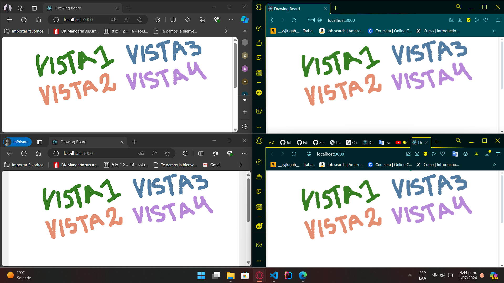
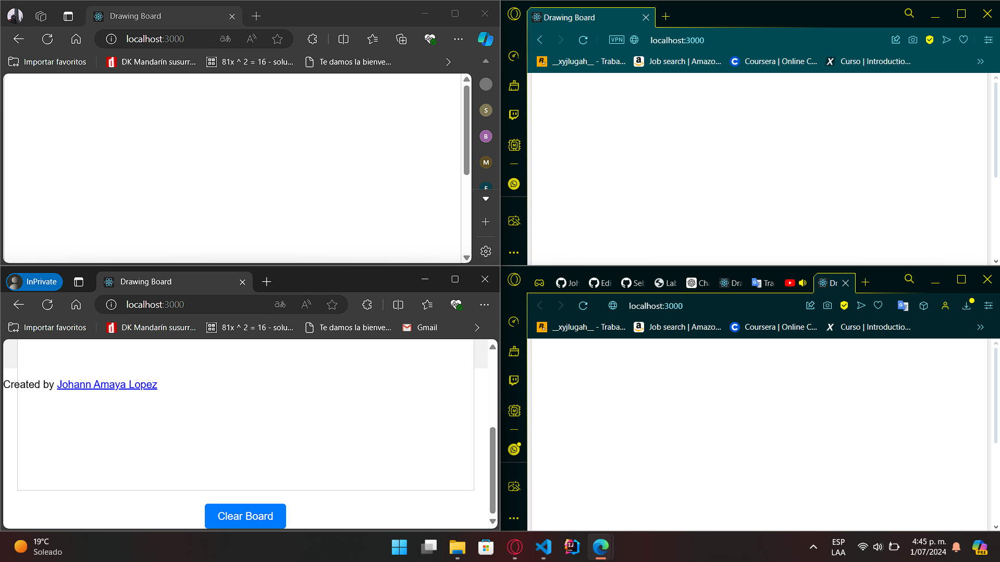

# BoardLive

BoardLive is a collaborative web application that allows multiple users to draw simultaneously on a virtual board. It utilizes React for the frontend and Spring Boot for the backend.

## Key Features

- **Collaborative Drawing**: Multiple users can draw simultaneously on the same virtual board.
- **Board Clearing**: Users can clear all drawings on the board with a dedicated button.
- **Real-Time Updates**: Changes on the board are instantly reflected for all connected users.

## Project Structure

### Frontend (React)

The frontend is built using React and utilizes p5.js for the drawing area.

#### Main Components

1. **App.js**:
   - Main component managing state for clicks and color.
   - Includes a button to clear the board and an `ActionFetcher` component to fetch updates from the server.

2. **Board.js**:
   - Component representing the drawing area using p5.js.
   - Renders clicks on the board and handles drawing interactions.

3. **ActionFetcher.js**:
   - Component for periodic fetching of actions from the server using `axios`.
   - Updates clicks state in the main component (`App.js`).

### Backend (Spring Boot)

The backend is developed in Spring Boot and provides REST endpoints for managing board clicks.

#### Main Classes

1. **BoardApp.java**:
   - Main class that initializes the Spring Boot application.
   - Configures and launches the server to handle REST requests.

2. **Controller.java**:
   - REST controller handling board click operations.
   - Defines endpoints for adding, retrieving, and clearing clicks.

3. **ClickBoard.java**:
   - POJO class representing a click on the board.
   - Contains properties like coordinates (x, y), color, and timestamp.

## Architecture


1. **User Interaction**:
   - Users interact with the application through the web interface provided by React.

2. **Request Handling**:
   - User requests are received by the Spring Boot server, which handles them using REST controllers.

3. **Real-Time Updates**:
   - Utilizes `axios` to send and receive data between frontend and backend, keeping the board updated for all users.

## Installation and Execution

### Prerequisites

- Java Development Kit (JDK) 8 or higher
- Apache Maven
- Node.js and npm (for React frontend)

### Installation Steps

1. **Clone the Repository**:

   ```bash
   git clone https://github.com/JohannBulls/BoardLive.git
   cd BoardLive
   ```

2. **Compile and Run the Backend**:

   ```bash
   cd boardliveSPRING
   mvn clean package
   mvn spring-boot:run
   ```

3. **Compile and Run the Frontend**:

   ```bash
   cd boardliveREACT
   npm install
   npm start
   ```

   

4. **Access the Application**:
   - Open your web browser and go to `http://localhost:3000`.
   - You will see the BoardLive application running, where multiple users can draw simultaneously.
   

5. **Clearing the Board**:
   - Click on the "Clear Board" button at the bottom of the page.
   - This action sends a request to the backend to clear all drawings from the board.
   - All users will see the board cleared instantly.
   

6. **Observing Real-Time Updates**:
   - As users draw on the board, changes are instantly reflected for all connected users.
   - The application demonstrates real-time collaborative drawing functionality.
    


## Technologies Used

- **Frontend**: React, p5.js, axios
- **Backend**: Spring Boot, Java
- **Tools**: Maven for dependency management

## Author

- Johann Amaya Lopez - *JohannBulls* - [GitHub](https://github.com/JohannBulls)

## License

This project is licensed under the MIT License. See the [LICENSE](LICENSE.txt) file for details.

